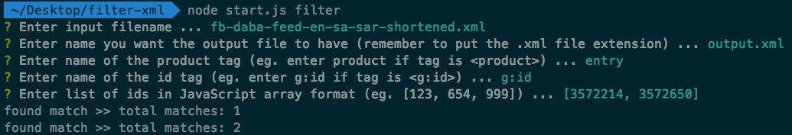

# Filter XML - CLI tool

This is a tool that parses every single `<product>` node (can be named differently) and outputs only those that match a list of IDs.

### Example use case

For example, if this is the input file:

```xml
<?xml version="1.0"?>
<feed xmlns="http://www.w3.org/2005/Atom" xmlns:g="http://base.google.com/ns/1.0">
<title>JollyChic</title>
<link rel="self" href="http://www.jollychic.com"/>

<entry>
<g:id>3557856</g:id>
<g:title> ... </g:title>
<g:description>  ... </g:description>
<g:product_type> ... </g:product_type>
<g:link> ... </g:link>
<g:image_link> ... </g:image_link>
<g:brand> ... </g:brand>
<g:condition> ... </g:condition>
<g:availability> ... </g:availability>
<g:price> ... </g:price>
<g:sale_price> ... </g:sale_price>
<g:sale_price_effective_date></g:sale_price_effective_date>
<g:google_product_category> ... </g:google_product_category>
<applink property="ios_url" content="..." />
</entry>

<entry>
<g:id>3557858</g:id>
<g:title> ... </g:title>
<!-- ... omitted for brevity -->
<applink property="ios_url" content="..." />
</entry>

<!-- ... 100000 more <entry> tags -->

</feed>
```

Then the output, when filtered for IDs that match "3557856", will output only this:

```xml
<entry>
<g:id>3557856</g:id>
<g:title> ... </g:title>
<g:description>  ... </g:description>
<g:product_type> ... </g:product_type>
<g:link> ... </g:link>
<g:image_link> ... </g:image_link>
<g:brand> ... </g:brand>
<g:condition> ... </g:condition>
<g:availability> ... </g:availability>
<g:price> ... </g:price>
<g:sale_price> ... </g:sale_price>
<g:sale_price_effective_date></g:sale_price_effective_date>
<g:google_product_category> ... </g:google_product_category>
<applink property="ios_url" content="..." />
</entry>
```

__NOTE__: The XML headers in the file will not be in the output file. You'll need to add that into the output file yourself by copy-pasting!

### Install

* Install Node if you haven't already done so with the package ([download from Nodejs](https://nodejs.org/en/download/))
* Run `npm install` to install all dependencies

### Usage

```
node start.js filter
```

This will bring up the interactive prompt with questions.



Once the output file is generated, check the contents of the file and add back the headers:

#### Good to know before using

* This will only work for product nodes that have only a single level of nesting (eg. it will work for `<entry><color>Blue</color></entry>` but not `<entry><colors><option1>Blue</option1><option2>Green</option2></colors></entry>`)
* Ensure that the input file is in the root directory of this folder, on the same level as `start.js`. Otherwise it wouldn't work.
* Make sure your XML file is UTF-8 encoded.


